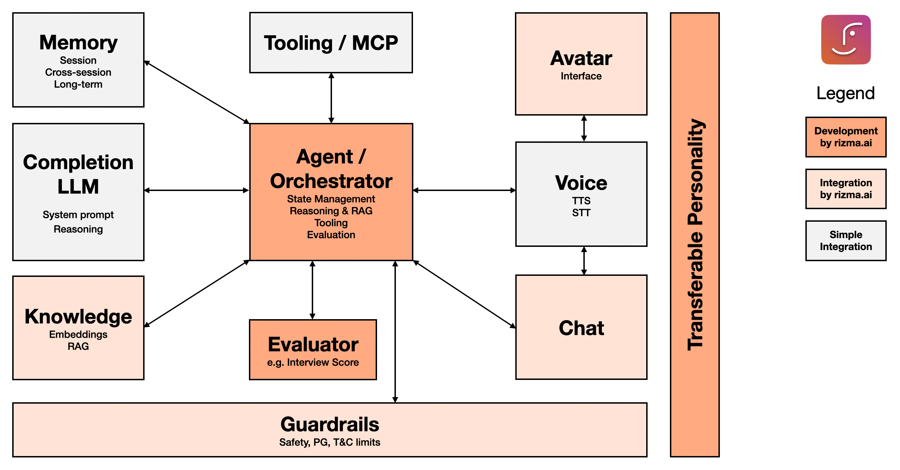

**rizma-heygen** is a high-fidelity AI role-play platform designed for immersive job interview simulations. By combining real-time visual streaming with sophisticated backend orchestration, rizma provides candidates with realistic, company-specific interview practice.

The project utilizes a **Hybrid Architecture**:
* **Frontend (TypeScript):** High-performance UI and WebRTC streaming for the HeyGen Avatar.
* **Backend (Python):** Robust AI orchestration, state management, and RAG-driven interview logic.

---

## 🏗 Architecture & Tech Stack

Rizma.ai is built for modularity, allowing each component to be swapped or scaled independently.

### 🧩 Frontend (The "Presence")
- **Language:** TypeScript
- **Framework:** Next.js / React
- **Avatar SDK:** HeyGen Streaming SDK (WebRTC)
- **State Management:** React Hooks & Context API

### 🧠 Backend (The "Brains")
- **Language:** Python 3.11+
- **API Framework:** FastAPI
- **Orchestration:** LangGraph / LangChain
- **Validation:** Pydantic v2
- **Memory:** Redis (Session) & Pinecone (Vector Search)



---

## 🚀 Key Features

* **Modular Service Interface:** Standardized "Adapters" for LLMs, Voice, and Avatars to prevent vendor lock-in.
* **Context-Injected Roleplay:** Python-driven RAG (Retrieval-Augmented Generation) that pulls specific company values, recent news, and role requirements into the interview.
* **Real-time Interaction:** Low-latency feedback loops between the Python logic and the HeyGen streaming interface.
* **Performance Analytics:** Post-session scoring based on technical accuracy, communication style, and sentiment analysis.

---

## 🚦 Getting Started

### Prerequisites
* Node.js (v18+) & Python (3.11+)
* Docker (Optional, for Vector DB/Redis)
* API Keys: HeyGen, Anthropic (Claude), and ElevenLabs.

### 1. Backend Setup (Python)
```bash
cd backend
python -m venv venv
source venv/bin/activate  # or venv\Scripts\activate on Windows
pip install -r requirements.txt
uvicorn main:app --reload
```

### 2. Frontend Setup (TypeScript)
```bash
cd frontend
npm install
npm run dev
```

### 📂 Project Structure
```bash
rizma-ai/
├── backend/            # Python (FastAPI) - Logic, RAG, Memory
│   ├── app/
│   │   ├── services/   # LLM & Logic providers
│   │   ├── agents/     # LangGraph interview flows
│   │   └── models/     # Pydantic schemas
├── frontend/           # TypeScript (Next.js) - UI & HeyGen SDK
│   ├── src/
│   │   ├── components/ # Avatar & UI elements
│   │   ├── hooks/      # WebRTC & SDK management
│   │   └── types/      # Shared interfaces
└── CLAUDE.md           # AI Agent instructions & coding standards
```

### 📄 License
MIT – rizma.ai
